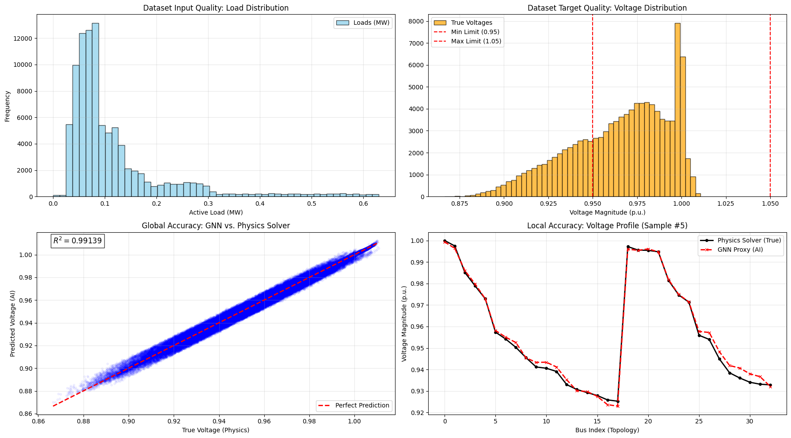
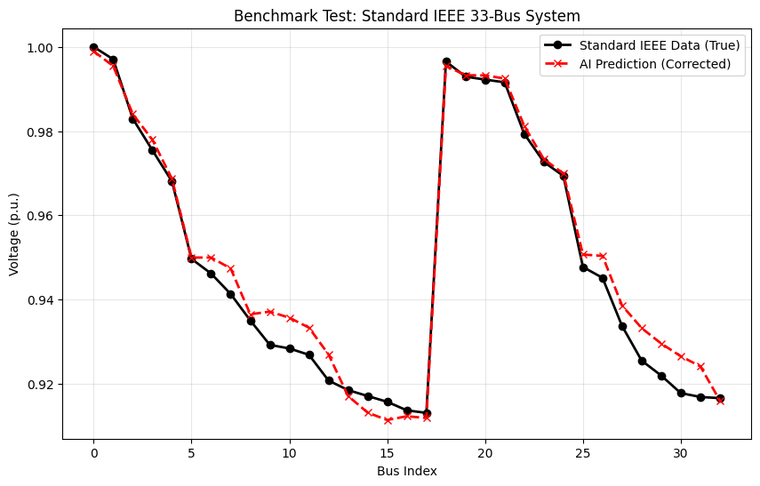

# Topology-Aware GNN for AC Power Flow

A physics-informed Graph Neural Network (GNN) that approximates AC power flow in distribution grids. It merges physics-consistent training data (AC power flow solutions) with a topology-adaptive GNN to produce fast voltage predictions, enabling near real-time simulations suitable for monitoring and preliminary risk assessment of distribution grids.


---

## Table of Contents
- [Overview](#overview)
- [Installation](#installation)
- [Usage](#usage)
- [Results](#results)
- [License](#license)

---

## Overview
This project implements a topology-adaptive GNN using PyTorch Geometric to predict voltage magnitudes and angles in distribution grids. It merges physics knowledge (AC power flow equations) with machine learning to enable millisecond-latency simulations, suitable for real-time monitoring and risk assessment of power systems.

Key features:
- Topology-adaptive Graph Neural Network (TAGConv layers)  
- Trains on IEEE 33-bus distribution system  
- Predicts voltage magnitude and angle with R² > 0.99  
- Fast approximation: 10,000× speedup over classical Newton-Raphson solver  
- Generalizes to different grid topologies (IEEE 30-bus benchmark tested)

---

## Installation
Clone the repository:


## Results

After training the topology-aware GNN, the model achieved excellent performance:

- Overall Accuracy (R²): 0.99139 (Target: > 0.99)  
- Mean Squared Error (MSE): 0.00000682 (Target: < 0.0001)  
- Dataset Check: Minimum voltage in dataset was 0.8666 p.u.

### Visualizations

The model’s predictions can be visually inspected through multiple plots:

 



Benchmark Test:  



```bash
git clone https://github.com/ra-emami/topology-aware-gnn-power-flow.git
cd topology-aware-gnn-power-flow
