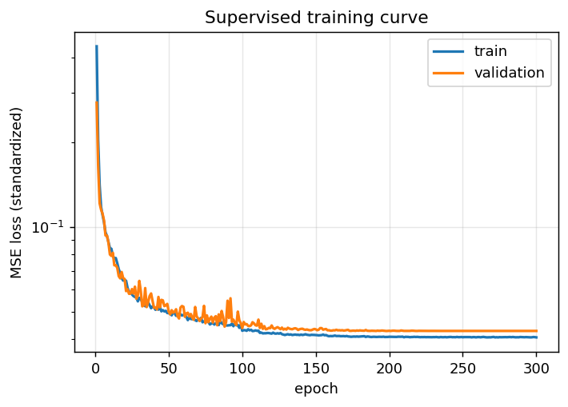
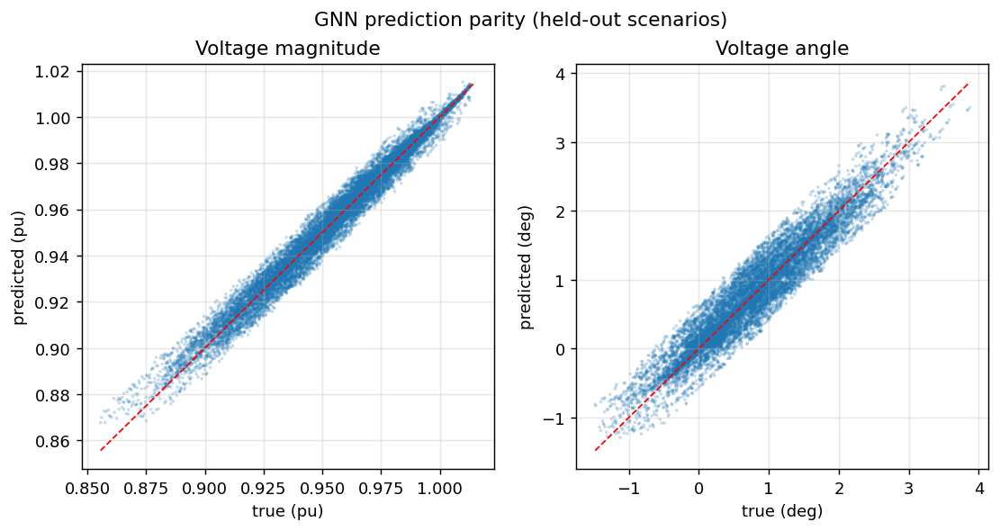
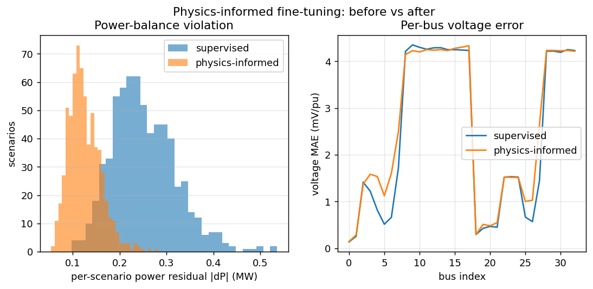
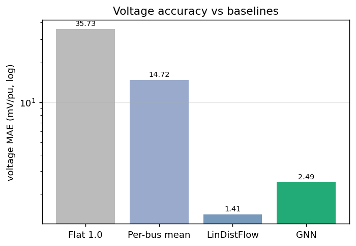
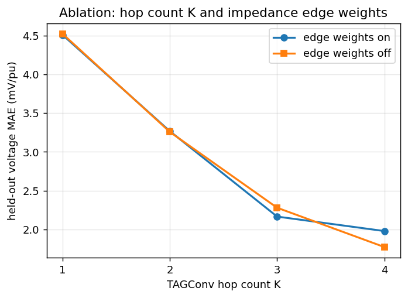
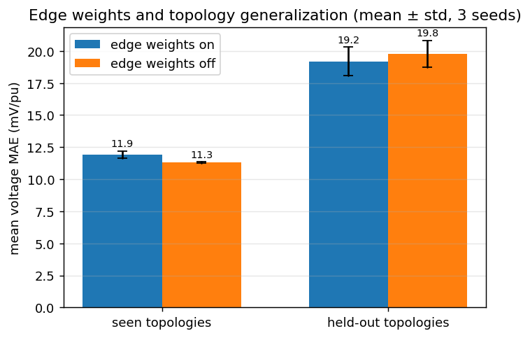
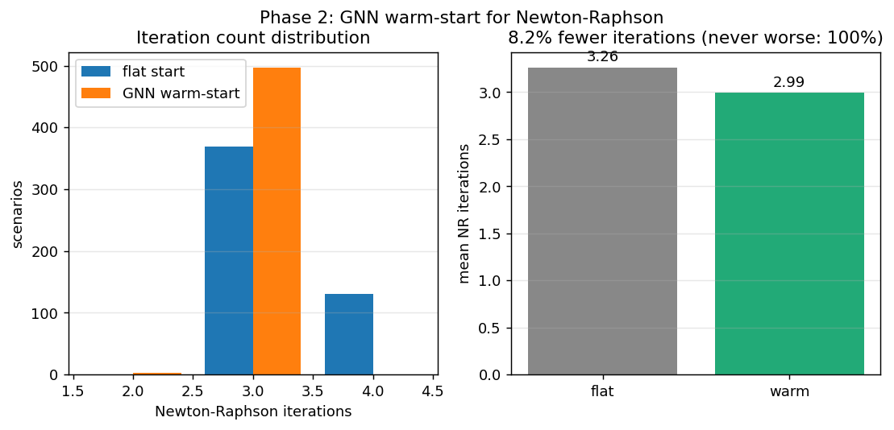

# Topology-Aware, Physics-Informed GNN for AC Power Flow

A Graph Neural Network that predicts bus voltage **magnitude and angle** for the
IEEE 33-bus distribution feeder (`case33bw`), trained against Newton–Raphson
solutions and refined with a **physics-informed** objective so its predictions
obey the AC power-balance law. The model is *topology-aware*: each branch carries
its per-unit series-admittance as an edge weight, so the network sees the
electrical structure of the grid and can be evaluated across reconfigurations.

## Why this is interesting

A learned surrogate for power flow is only useful if it is (a) more than a trivial
regressor, (b) physically consistent, and (c) able to handle the topology changes
that real feeders undergo. This project addresses all three: it benchmarks against
analytical baselines (including LinDistFlow), measures and reduces the AC
power-balance residual, and trains/evaluates across radial reconfigurations.

## Results

The figures below are generated from full runs (5000–6000 scenarios); a fresh run
may vary slightly with seed and hardware. The full write-up, with methodology and
per-experiment discussion, lives in [REPORT.md](REPORT.md).

### Supervised surrogate and physics-informed fine-tuning





On the held-out test set the supervised model reaches **Voltage R²=0.983**
(**MAE 2.57 mV/pu**), **Angle R²=0.931** (**MAE 0.12°**), with an AC active-power
residual of **|dP|=0.261 MW**. The parity plot shows predictions tracking the
Newton–Raphson (NR) ground truth across the full voltage range.



Physics-informed fine-tuning (λ=10) roughly **halves the AC power-balance
violation** at negligible accuracy cost: **|dP| 0.254 → 0.107 MW (~58% lower)** and
**|dQ| 0.235 → 0.110 MVAr (~53% lower)**, while Voltage R² holds at ~0.983. The
model trades a fraction of a millivolt of fit for markedly more physically
consistent predictions.

### Baselines



Against a flat 1.0 pu start, a per-bus mean, and the linear **LinDistFlow**
approximation, the GNN reaches **~2.6 mV/pu voltage MAE** on the base feeder. On a
single radial feeder LinDistFlow is a genuinely strong baseline; the GNN's edge is
its differentiability, physics-consistency, and cross-topology transfer rather than
raw single-feeder accuracy.

### K and edge-weight ablation



On a single fixed topology, the TAGConv hop count **K** dominates accuracy: going
from K1 to K4 more than halves voltage MAE (**4.52 → 1.98 mV/pu** with edge weights
on; **4.53 → 1.46 mV/pu** with them off). The best single-topology config is
**K=4, edge-weights-off (MAE 1.46 mV/pu, R²=0.9916)**. Notably, on a *fixed*
topology the impedance edge weights are roughly neutral and slightly better off at
high K — which sets up the topology-general finding below.

### Topology-general edge weights (Phase 1)



Training across **42 seen reconfigurations** and testing on **17 held-out** ones (59
valid radial configs total) shows the topology-general model transfers to unseen
topologies (**held-out 18.18 mV/pu** vs **19.88** for a single-topology model on the
same targets). Holding everything fixed except the edge-weight switch, **impedance
edge weights improve generalization**: held-out MAE **18.14 vs 18.79 mV/pu (~3.4%
lower)** and a tighter generalization gap (**+5.68 vs +7.64**), at the cost of
fitting seen topologies slightly less tightly. This resolves the tension with the
single-topology ablation — the impedance weighting is an inductive bias whose value
appears specifically when the **topology changes**, justifying "topology-aware."
(Caveat: modest ~3.4% margin, single seed.)

### NR warm-start (Phase 2)



Used to warm-start Newton–Raphson on 500 base-feeder scenarios, the surrogate cuts
mean NR iterations **3.26 → 3.00 (~8.0% fewer)** and is **never worse than a flat
start** (100% of scenarios; strictly faster in 26.2%). Both starts converge to an
identical solution (max |V| discrepancy ~7e-9 pu). Wall-clock improves 22.6 → 19.2
ms (×1.18), but at 33 buses wall-clock is dominated by pandapower per-call setup, so
**iteration count is the scale-free metric**. The surrogate is a safe, measurable NR
accelerator; headroom is modest on a small, well-conditioned feeder (NR needs only
~3.3 iterations from flat) and would grow on larger, stiffer systems and at tighter
tolerances.

### Limitations

Results are on a single 33-bus feeder and mostly a single seed; absolute margins for
edge-weight generalization (~3.4%) and warm-start (~8%) are modest. LinDistFlow is a
strong baseline on one radial feeder, so the GNN's value is differentiability,
physics-consistency, and cross-topology transfer. NR data generation is CPU-bound
(pandapower), so scaling is limited by scenario generation rather than GPU. Planned
next steps: a 69-bus feeder with cross-feeder transfer, multi-seed error bars, and a
differentiable NR correction layer for hard feasibility.

## Repository structure

```
topology-aware-pignn/
├── src/pignn/
│   ├── config.py       # constants (DER buses, seeds, dispatch ranges)
│   ├── topology.py     # impedance-weighted graph, radial reconfiguration, LinDistFlow
│   ├── data.py         # scenario generation (single / multi-topology), splits, scaling
│   ├── model.py        # ProxySolverGNN (TAGConv)
│   ├── physics.py      # admittance matrix + differentiable power-balance residual
│   ├── train.py        # supervised training + physics-informed fine-tuning
│   └── evaluate.py     # metrics, baselines, undervoltage, topology generalization
├── scripts/
│   ├── train.py                   # supervised training -> checkpoints/gnn_powerflow.pt
│   ├── finetune_physics.py        # physics-informed fine-tuning -> ..._pinn.pt
│   ├── evaluate.py                # baselines + physics + topology generalization report
│   └── train_topology_general.py  # train across reconfigurations, test on held-out topologies
├── pyproject.toml
├── requirements.txt
└── README.md
```

## Installation

```bash
python -m venv .venv && source .venv/bin/activate     # optional
pip install -e .                                      # or: pip install -r requirements.txt
```

The scripts also add `src/` to the path, so they run from the repo root without
installation. A GPU is recommended for full-size runs.

## Usage

```bash
# 1) Train the supervised surrogate
python scripts/train.py --samples 5000 --epochs 300

# 2) Physics-informed fine-tuning (lambda controls accuracy/consistency balance)
python scripts/finetune_physics.py --ckpt checkpoints/gnn_powerflow.pt --lam 10

# 3) Full evaluation: baselines, physics consistency, undervoltage screening, topology generalization
python scripts/evaluate.py --ckpt checkpoints/gnn_powerflow_pinn.pt

# 4) Topology-general training (train across reconfigurations, test on held-out topologies)
python scripts/train_topology_general.py --samples 6000 --epochs 200

# 5) Ablations: TAGConv hop count K, and impedance edge weights across topologies
python scripts/ablate_k.py --ks 1 2 3 4
python scripts/ablate_edgeweights_topology.py --samples 6000 --epochs 200

# 6) GNN warm-start for Newton-Raphson (solver acceleration)
python scripts/warmstart_nr.py --n 500

# 7) Render every figure from results/ + checkpoints into figures/
python scripts/make_figures.py
```

Every script accepts `--quick` for a fast smoke run. The training, ablation, and
warm-start scripts persist their metrics to `results/` (JSON/CSV), which
`scripts/make_figures.py` reads to render `figures/`. To reproduce everything on a
GPU, see [notebooks/reproduce_on_colab.ipynb](notebooks/reproduce_on_colab.ipynb).

## Method

- **Impedance-weighted graph.** Each in-service branch is weighted by the magnitude
  of its per-unit series admittance `|y| = 1/sqrt(R² + X²)`; normally-open tie
  switches are excluded, giving the true radial tree.
- **Scenarios.** Random load scaling and DER active/reactive dispatch, solved with
  Newton–Raphson. Node features `[P, Q, is_DER, is_slack]`; targets `[V, θ]`.
- **Physics-informed objective.** The admittance matrix **Y** yields a differentiable
  power-balance residual `S = V ⊙ conj(YV)` added to the loss as `MSE + λ · residual`.
- **Topology generalization.** Valid radial reconfigurations are enumerated by
  closing each tie switch and opening one line on the loop it creates; the model is
  trained on a subset and evaluated on held-out configurations.

## Roadmap

- **Ablations.** Sweep the TAGConv hop count `K` and toggle the impedance edge
  weights to quantify the contribution of multi-hop, impedance-aware propagation.
- **Additional feeders.** Extend to the 69-bus system and cross-feeder transfer.
- **Hard feasibility.** Replace the soft penalty with a differentiable
  Newton–Raphson correction layer, or use the surrogate to warm-start NR and
  measure iteration savings.

## Stack

PyTorch · PyTorch Geometric (`TAGConv`) · pandapower · scikit-learn · matplotlib
